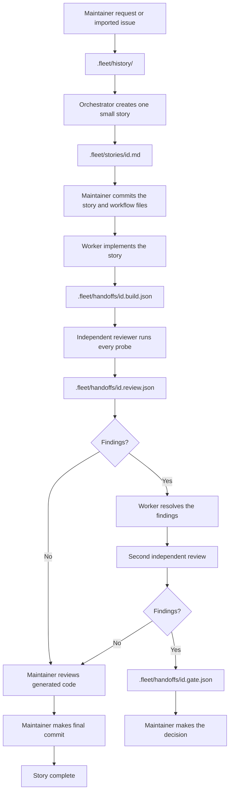

# Contributing workflow

This workflow keeps task instructions, agent handoffs, and review separate.

## The folders

| Location            | Purpose                                          | Created by                            |
| ------------------- | ------------------------------------------------ | ------------------------------------- |
| `.fleet/history/`   | Source requests and known constraints            | Maintainer or imported document       |
| `.fleet/stories/`   | A clear work order with direct acceptance probes | Orchestrator                          |
| `.fleet/handoffs/`  | Build records, reviewer findings, and blockers   | Worker or reviewer                    |
| `.fleet/designs/`   | Standalone HTML prototypes for frontend stories  | Orchestrator during story preparation |
| `.fleet/templates/` | Starting files for stories and handoffs          | Repository                            |
| `.fleet/examples/`  | A small reference story                          | Repository                            |

## Workflow usage

1. Add one request to `.fleet/history/`.
2. Turn it into one small story. Define its allowed paths and acceptance criteria. 
3. For a frontend story, include `.fleet/designs/<id>.html` in the allowed paths and add it as the Design prototype. The orchestrator creates the standalone HTML prototype for each frontend story. It shows the intended visual result and does not need to be functional.
4. Commit the story and workflow files. Workers start from the committed `HEAD`; uncommitted files are not included in their worktree. 
5. A worker implements the story and records the build handoff.
6. A different reviewer regenerates the checks and writes findings.
7. If review finds no issue, the maintainer reviews the generated code. If it finds an issue, the worker resolves it and a different reviewer runs one more review round.
8. After a review has no findings, the maintainer makes the final commit. The orchestrator does not commit worker or reviewer changes.
9. If the second review still finds issues, stop and ask the maintainer through a gate handoff.

No agent may approve its own work. A passing check must be able to fail when the specified breakage is introduced.