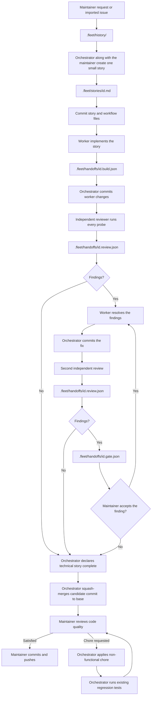

# Contributing workflow

This workflow keeps task instructions, agent handoffs, and review separate.

## Workflow usage

1. Add one request to `.fleet/history/`.
2. Turn it into one small story. Define its allowed paths and acceptance criteria.
3. For a frontend story, include `.fleet/designs/<id>.html` in the allowed paths and add it as the Design prototype. The orchestrator creates the standalone HTML prototype for each frontend story. It shows the intended visual result and does not need to be functional.
4. Commit the story and workflow files. Workers start from the committed `HEAD`; uncommitted files are not included in their worktree.
5. A worker implements the story and records the build handoff. The orchestrator commits the worker changes so the reviewer has a clean worktree at the candidate commit.
6. A different reviewer regenerates the checks and records its findings. If it finds an issue, the worker resolves it. The orchestrator commits the repair before a different reviewer runs a fresh review.
7. If the second review has no findings, the orchestrator declares the technical story completed. If it still finds issues, it opens a gate. The maintainer can reject the finding and continue to the final review, or accept it and send the worker to another repair and independent review.
8. On the base branch, the orchestrator runs `git merge --squash <candidate-commit>` for the last reviewed commit. It does not commit the merge result. The candidate product changes remain staged for the maintainer.
9. The maintainer reviews the generated code on the base branch. If satisfied, the maintainer makes the final commit and pushes it.
10. If the maintainer requests a chore, the orchestrator applies it only when it does not change functional behaviour, acceptance criteria, probes, `red_when` breakages, or tests. The orchestrator runs relevant existing tests as regression checks, stages the chore changes, and returns the staged change to the maintainer for review.
No agent may approve its own work. A passing check must be able to fail when the specified breakage is introduced. The regression checks after a maintainer chore do not replace independent acceptance verification.

## The folders

| Location            | Purpose                                          | Created by                            |
| ------------------- | ------------------------------------------------ | ------------------------------------- |
| `.fleet/history/`   | Source requests and known constraints            | Maintainer or imported document       |
| `.fleet/stories/`   | A clear work order with direct acceptance probes | Orchestrator + Maintainer             |
| `.fleet/handoffs/`  | Build records, reviewer findings, and blockers   | Worker, reviewer, or orchestrator     |
| `.fleet/designs/`   | Standalone HTML prototypes for frontend stories  | Orchestrator during story preparation |
| `.fleet/templates/` | Starting files for stories and handoffs          | Repository                            |
| `.fleet/examples/`  | A small reference story                          | Repository                            |
