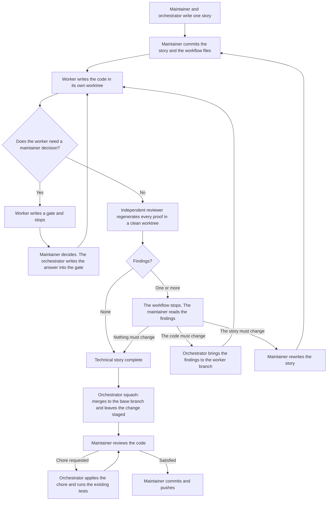

# Contributing workflow

This file explains how work moves through the repository. It does not define the rules.
[AGENTS_CONTRIBUTING.md](AGENTS_CONTRIBUTING.md) defines them. If the two disagree, that file wins.

## The idea

One story describes one small reversible change. An agent builds it. A second, independent agent
regenerates every proof from scratch. The maintainer makes every commit on the base branch.

Three principles hold the workflow together:

- No agent approves its own work.
- A check that passes must be able to fail. Each acceptance criterion states the breakage that must break it.
- An agent never decides for the maintainer, and never guesses.

The maintainer talks to the orchestrator. The orchestrator talks to the workers and the reviewers.

## The roles

- **Maintainer** — You. You bring the problem, decide every gate and every finding, review the final code, and make every commit on the base branch. You never talk to a worker or a reviewer.
- **Orchestrator** — The agent you talk to. It writes the story with you, creates the branches and the worktrees, spawns and supervises the other agents, and records your decisions. It writes no product code.
- **Worker** — The agent that implements one story in its own worktree and records its evidence. It never verifies its own work, and never touches a path the story does not list.
- **Reviewer** — The agent that regenerates every probe and every breakage from scratch, in a clean worktree at the commit under review. It reports findings and repairs nothing. It never gives a verdict.

## The flow

## Step by step

The steps below follow the diagram, one for each box and each decision.

1. **The maintainer and the orchestrator write one story.** They agree on the problem, the options, and the constraints. The story lists the allowed paths and the acceptance criteria. A story that introduces a new visual surface also gets a standalone HTML prototype in `.fleet/designs/`. The orchestrator could also make it before the work starts. It shows the intended visual result and does not operate. A story that only changes existing UI covers the visual result with an acceptance criterion instead.
2. **The maintainer commits the story and the workflow files.** The agents start from the committed state.
3. **The worker writes the code in its own worktree.** The worker records its evidence and its build, and commits them in its worktree.
4. **Does the worker need a maintainer decision?**
   - Yes. The worker writes a gate and stops. The maintainer decides. The orchestrator writes the answer into the gate. The work continues at step 3.
   - No. Continue at step 5.
5. **An independent reviewer regenerates every proof in a clean worktree.** The reviewer does each probe again. It also does each breakage again. Then it commits its findings.
6. **Are there findings?**
   - None. The technical story is complete. Continue at step 8.
   - One finding or more. The workflow stops. Continue at step 7.
7. **The maintainer reads the findings.** There are three ways out.
   - Nothing must change. The orchestrator writes the reason into each finding that the maintainer rejects. The technical story is complete. Continue at step 8.
   - The code must change. The orchestrator brings the findings to the worker branch. The work continues at step 3.
   - The story must change. The maintainer rewrites the story. The work continues at step 2.
8. **The orchestrator squash-merges the candidate commit into the base branch.** The changes stay in the staging area. The orchestrator does not commit them.
9. **The maintainer reviews the code.** There are two ways out.
   - The maintainer asks for a chore. A chore does not change the behaviour. The orchestrator does it, runs the existing tests as a regression check, and puts the result in the staging area. The review starts again at step 9.
   - The maintainer is satisfied. Continue at step 10.
10. **The maintainer commits the change and pushes it.**

## Glossary

### The files

- **Handoff** — The file an agent writes to end its pass, in `.fleet/handoffs/`. It is the report.
- **Build** — `build.json`. What the worker did in one pass, `done` or `failed`, with the red and the green result of every probe.
- **Review** — `review.json`. What the reviewer found in one pass, as a list of findings. An empty list means it regenerated everything and found nothing.
- **Finding** — One entry in `review.json`. Technical evidence that an acceptance criterion or a constraint does not hold. It is never a question: you decide what to do about it.
  - **`maintainer_rejected`** — The field inside a finding. The orchestrator writes your reason there when you reject the finding. It stays null while the finding stands.
- **Gate** — A question about the story, delegated to you. Only a worker opens one, when it cannot finish the pass without your answer. Read in order, the gates explain why a story went the way it went.
  - **`resolution`** — The field inside a gate. The orchestrator writes your answer and your reason there. It stays null while the gate is open, and an open gate blocks the story.

### The Git objects

- **Base branch** — The branch the work lands on. Only you commit here.
- **Worker branch** — `worker/<id>` in `.worktree/<id>`. Where one story is implemented and repaired.
- **Reviewer branch** — `reviewer/<id>/<n>` in `.worktree/<id>-review-<n>`. A clean copy at the commit under review, one for each review pass. A reviewer never sees the worker worktree.
- **Candidate commit** — The commit the agents are finished with: the last reviewer commit with no findings, or with every finding rejected. It is the one squash-merged onto the base branch for your final review.

## Where everything lives

| Path                     | Holds                                                             |
| ------------------------ | ----------------------------------------------------------------- |
| `.fleet/stories/`        | The work orders, and the builder evidence recorded for each one   |
| `.fleet/handoffs/`       | Builds, reviews, and gates                                        |
| `.fleet/designs/`        | One standalone HTML prototype, when a story has one                |
| `.fleet/templates/`      | The exact shape of a story, a build, a review, and a gate         |
| `.pi/agents/`            | The worker and reviewer roles, and the model each one runs        |
| `scripts/fleet/`         | Helpers that write the standard files                             |
| `AGENTS_CONTRIBUTING.md` | The rules every agent follows                                     |
| `AGENTS.md`              | Code conventions, with one more in each workspace                 |
