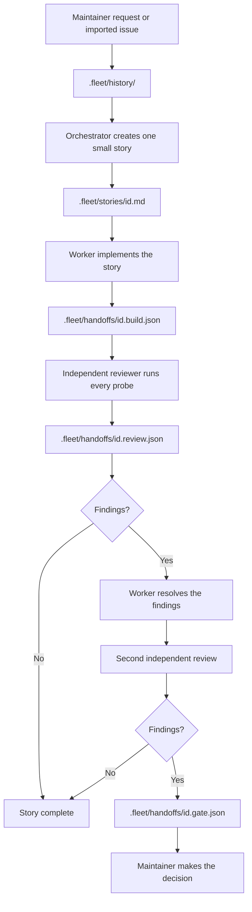

# Contributing workflow

This workflow keeps task instructions, agent handoffs, and review separate.

## The folders

| Location | Purpose | Created by |
| --- | --- | --- |
| `.fleet/history/` | Source requests and known constraints | Maintainer or imported document |
| `.fleet/stories/` | A clear work order with direct acceptance probes | Orchestrator |
| `.fleet/handoffs/` | Build records, reviewer findings, and blockers | Worker or reviewer |
| `.fleet/templates/` | Starting files for stories and handoffs | Repository |
| `.fleet/examples/` | A small reference story | Repository |

## The normal path

1. Add one request to `.fleet/history/`.
2. Turn it into one small story. Define its allowed paths and acceptance criteria.
3. Commit the story and workflow files. Workers start from the committed `HEAD`; uncommitted files are not included in their worktree.
4. A worker implements the story and records the build handoff.
5. A different reviewer regenerates the checks and writes findings.
6. If review finds no issue, the story is complete. If it finds an issue, the worker resolves it and a different reviewer runs one more review round.
7. If the second review still finds issues, stop and ask the maintainer through a gate handoff.

No agent may approve its own work. A passing check must be able to fail when the specified breakage is introduced.
