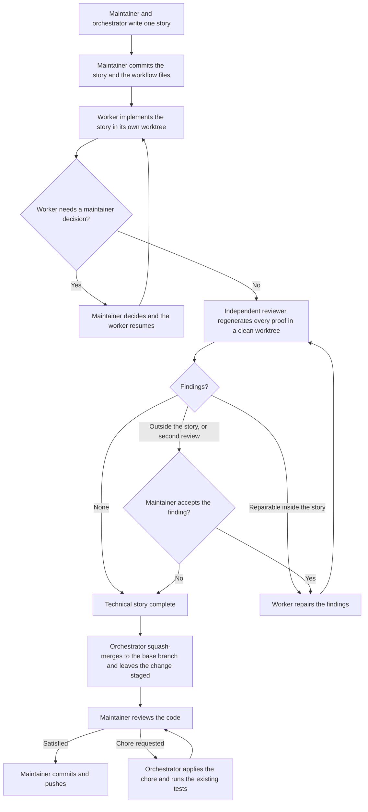

# Contributing workflow

This file explains how work moves through the repository. It does not define the rules.
[AGENTS_CONTRIBUTING.md](AGENTS_CONTRIBUTING.md) defines them. If the two disagree, that file wins.

## The idea

One story describes one small reversible change. An agent builds it. A second, independent agent
regenerates every proof from scratch. The maintainer makes every commit on the base branch.

Two principles hold the workflow together:

- No agent approves its own work.
- A check that passes must be able to fail. Each acceptance criterion states the breakage that must break it.

## The roles

| Role | Does |
| ---- | ---- |
| Maintainer | Gives the work, decides on gates, reviews the result, and makes every commit on the base branch |
| Orchestrator | Writes the story with the maintainer, creates branches and worktrees, launches and supervises the agents. Writes no product code |
| Worker | Implements one story in its own worktree and records its evidence |
| Reviewer | Runs every proof again in a separate clean worktree. Reports findings. Repairs nothing |

The maintainer talks only to the orchestrator. The orchestrator talks to the workers and the reviewers.

## The flow



## Step by step

1. The maintainer tells the problem to the orchestrator. They agree on the options and the constraints. The result is one story. The story has allowed paths and acceptance criteria.
2. A frontend story also has an HTML prototype in `.fleet/designs/`. The orchestrator makes the prototype before the work starts. The prototype shows the intended visual result. The prototype does not operate.
3. The maintainer commits the story, the prototype, and the workflow files. The agents start from the committed state. They do not receive the files that the maintainer does not commit.
4. The orchestrator makes the worker branch and its worktree. Then it starts the worker. The worker writes the code for the story. It records its evidence and its build handoff. It commits in its own worktree.
5. The worker stops if it needs a decision from the maintainer. It writes a gate. The maintainer selects an option. The orchestrator records the decision. Then the worker continues.
6. The orchestrator makes a clean worktree at the commit of the worker. Then it starts the first reviewer. The reviewer does each probe again. It also does each breakage again. Then it commits its findings.
7. The story is technically complete if there are no findings. If the story permits the repair, the worker repairs the findings. A second review comes after the repair. A cycle has a maximum of two reviews. If the story does not permit the repair, the reviewer writes a gate for the maintainer.
8. The orchestrator does a squash merge of the approved commit into the base branch. The changes stay in the staging area. The orchestrator does not commit them.
9. The maintainer examines the code. If the code is satisfactory, the maintainer commits it and pushes it.
10. The maintainer can ask for a chore that does not change the behaviour. The orchestrator does the chore. Then it runs the existing tests as a regression check. It puts the result in the staging area for a new review.

## Outcomes between agents

| Role     | Situation                                                                                | Handoff files                 | Build status   |
| -------- | ---------------------------------------------------------------------------------------- | ----------------------------- | -------------- |
| Worker   | Implementation is ready for independent review                                           | `build.json`                  | `done`         |
| Worker   | The story cannot produce a reviewable candidate because of a technical execution problem | `build.json`                  | `failed`       |
| Worker   | A maintainer decision is required                                                        | `gate.json`                   | None           |
| Reviewer | The review is complete, with findings or an empty findings array                         | `review.json`                 | Not applicable |
| Reviewer | A maintainer decision is required                                                        | `review.json` and `gate.json` | Not applicable |

A gate is neither `done` nor `failed`. The pass stops for a maintainer decision. A reviewer never gives a
pass or fail verdict. It writes `[]` when it finds nothing.

Each role overwrites the handoff for its current pass at the fixed story path. Git keeps every earlier version.

## The folders

| Location            | Purpose                                          | Created by                            |
| ------------------- | ------------------------------------------------ | ------------------------------------- |
| `.fleet/stories/`   | A clear work order with direct acceptance probes | Orchestrator + Maintainer             |
| `.fleet/handoffs/`  | Build records, reviewer findings, and blockers   | Worker, reviewer, or orchestrator     |
| `.fleet/designs/`   | Standalone HTML prototypes for frontend stories  | Orchestrator during story preparation |
| `.fleet/templates/` | Starting files for stories and handoffs          | Repository                            |

## Where each rule lives

This file describes. These files define. Change them, not this one.

| Subject                             | Source                                                                   |
| ----------------------------------- | ------------------------------------------------------------------------ |
| Rules for every agent               | [AGENTS_CONTRIBUTING.md](AGENTS_CONTRIBUTING.md)                         |
| Story format                        | [.fleet/templates/story.md](.fleet/templates/story.md)                   |
| Build handoff format                | [.fleet/templates/build.json](.fleet/templates/build.json)               |
| Gate format                         | [.fleet/templates/gate.json](.fleet/templates/gate.json)                 |
| Review findings format              | [.fleet/templates/review-findings.json](.fleet/templates/review-findings.json) |
| Worker role and model               | [.pi/agents/fleet-worker.md](.pi/agents/fleet-worker.md)                 |
| Reviewer role and model             | [.pi/agents/fleet-reviewer.md](.pi/agents/fleet-reviewer.md)             |
| Code conventions                    | [AGENTS.md](AGENTS.md) and the `AGENTS.md` of each workspace             |

Helper scripts write the standard files:

```sh
scripts/fleet/new-story.sh <id>
scripts/fleet/open-gate.sh <id>
scripts/fleet/record-build.sh <id>
scripts/fleet/record-review.sh <id>
```
