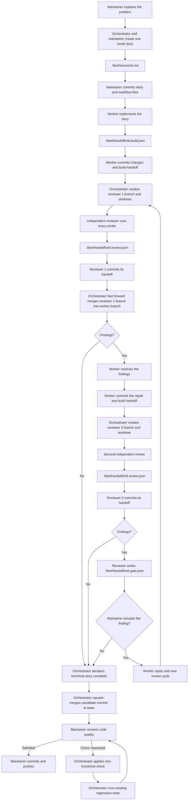

# Contributing workflow

This workflow keeps task instructions, agent handoffs, and review separate.



## Workflow usage

1. The maintainer explains the problem to the orchestrator. They can discuss options and constraints. The outcome is one small story with allowed paths and acceptance criteria. Every story must explicitly include its evidence and handoff paths in the allowed paths.
2. For a frontend story, include `.fleet/designs/<id>.html` in the allowed paths and add it as the Design prototype. The orchestrator creates the standalone HTML prototype for each frontend story. It shows the intended visual result and does not need to be functional.
3. The maintainer commits the story and workflow files. Workers start from the committed `HEAD`; uncommitted files are not included in their worktree.
4. A worker implements the story, records the build handoff, and commits its changes and handoff in its dedicated worktree.
5. The orchestrator creates a dedicated reviewer 1 branch and clean worktree from the worker commit. Reviewer 1 regenerates the checks, writes its handoff, and commits it in the reviewer worktree. The orchestrator then fast forward merges the reviewer branch into `fleet/<id>`. No findings complete the technical story. A repairable finding sends the worker to a repair pass. A finding outside the story requires the reviewer to open a gate.
6. After a repair, the worker commits it and its build handoff on `fleet/<id>`. The orchestrator then creates a dedicated reviewer 2 branch and clean worktree from that commit. Reviewer 2 sees the previous review and the repair build handoff, regenerates the checks, writes its handoff, and commits it in the reviewer 2 worktree. If it has no findings, its handoff commit is the candidate commit and the orchestrator declares the technical story completed. If it finds issues, the reviewer opens a gate. The maintainer can reject the finding and continue to the final review, or accept it and start a new review cycle with a worker repair and a fresh independent first review. A review cycle has at most two reviews.
7. The candidate commit is the last reviewer handoff commit whose `review.json` contains `[]`. It is the technical approval stamp. On the base branch, the orchestrator runs `git merge --squash <candidate-commit>`. It does not commit the merge result. The candidate product changes remain staged for the maintainer.
8. The maintainer reviews the generated code on the base branch. If satisfied, the maintainer makes the final commit and pushes it.
9. If the maintainer requests a chore, the orchestrator applies it only when it does not change functional behaviour, acceptance criteria, probes, `red_when` breakages, or tests. The orchestrator runs relevant existing tests as regression checks, stages the chore changes, and returns the staged change to the maintainer for review.

## Outcomes between agents


| Role     | Situation                                                                                | Terminal handoff | Build status   |
| -------- | ---------------------------------------------------------------------------------------- | ---------------- | -------------- |
| Worker   | Implementation is ready for independent review                                           | `build.json`     | `done`         |
| Worker   | The story cannot produce a reviewable candidate because of a technical execution problem | `build.json`     | `failed`       |
| Worker   | A maintainer decision is required                                                        | `gate.json`      | None           |
| Reviewer | The review is complete, with findings or an empty findings array                         | `review.json`    | Not applicable |
| Reviewer | A maintainer decision is required                                                        | `gate.json`      | Not applicable |


### Handoff examples

Worker `done`:

```json
{
  "id": "temperature-units",
  "branch": "fleet/temperature-units",
  "status": "done",
  "acs": [{ "ac": "AC1", "probe": "npm test", "red_ok": true, "green_ok": true }],
  "notes": ""
}
```

Worker `failed`:

```json
{
  "id": "temperature-units",
  "branch": "fleet/temperature-units",
  "status": "failed",
  "acs": [{ "ac": "AC1", "probe": "npm test", "red_ok": true, "green_ok": false }],
  "notes": "AC1: npm test exited 1 because the required service was unavailable."
}
```

Worker or reviewer gate:

```json
{
  "id": "temperature-units",
  "decision_so_far": "No implementation started.",
  "blocked": "The story does not define the fallback unit.",
  "options": ["celsius", "fahrenheit"],
  "recommendation": "celsius",
  "next_steps": { "option": "Continue with the selected unit." }
}
```

Reviewer finding. Use `[]` when the reviewer has no findings:

```json
[
  {
    "ac": "AC1",
    "severity": "medium",
    "confidence": 0.9,
    "evidence": "npm test passed, but the red_when breakage also passed."
  }
]
```

A gate is neither `done` nor `failed`. It has no build status because the pass stops for a maintainer decision. A reviewer never has a build status and never issues a pass or fail verdict.

Each role overwrites its active terminal handoff at the fixed story path for every new pass. After the maintainer resolves a gate, the orchestrator renames `.fleet/handoffs/<id>.gate.json` to `.fleet/handoffs/<id>.gate.superseded.json` and commits the rename before it launches the resumed pass. The superseded gate records the resolved blocker but is not terminal. A reviewer writes `[]` when it has no findings.

No agent may approve its own work. A passing check must be able to fail when the specified breakage is introduced. The regression checks after a maintainer chore do not replace independent acceptance verification.

## The folders


| Location            | Purpose                                          | Created by                            |
| ------------------- | ------------------------------------------------ | ------------------------------------- |
| `.fleet/stories/`   | A clear work order with direct acceptance probes | Orchestrator + Maintainer             |
| `.fleet/handoffs/`  | Build records, reviewer findings, and blockers   | Worker, reviewer, or orchestrator     |
| `.fleet/designs/`   | Standalone HTML prototypes for frontend stories  | Orchestrator during story preparation |
| `.fleet/templates/` | Starting files for stories and handoffs          | Repository                            |
| `.fleet/examples/`  | A small reference story                          | Repository                            |


